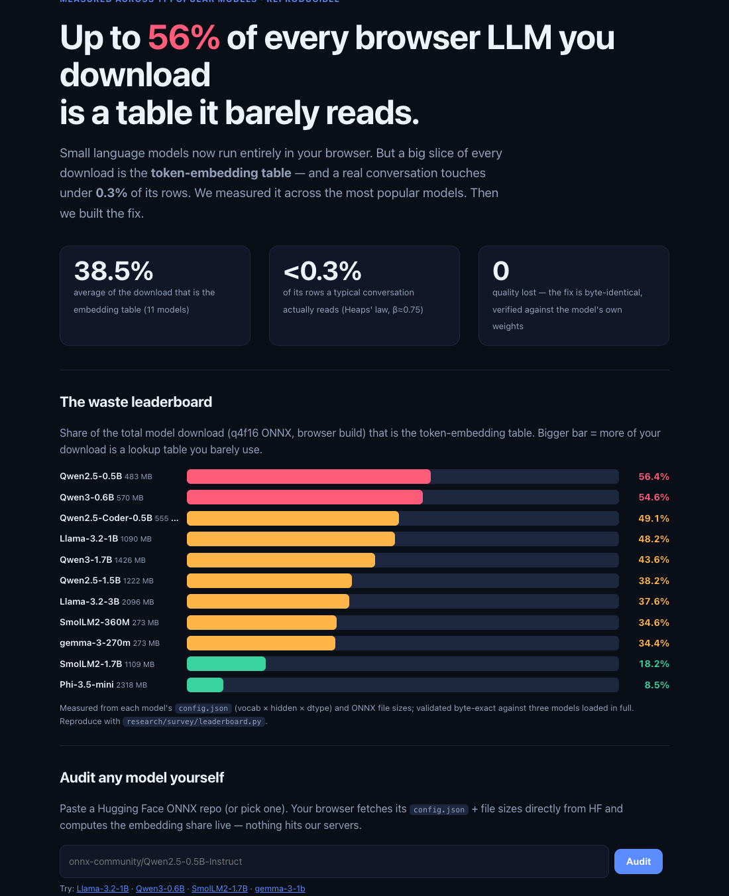
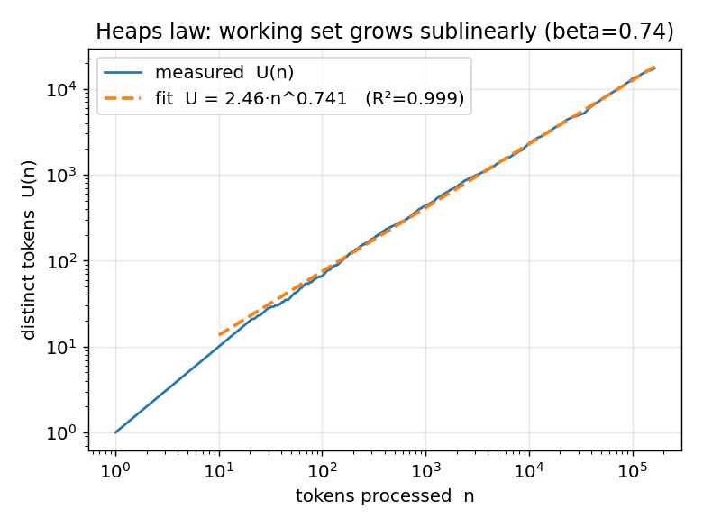
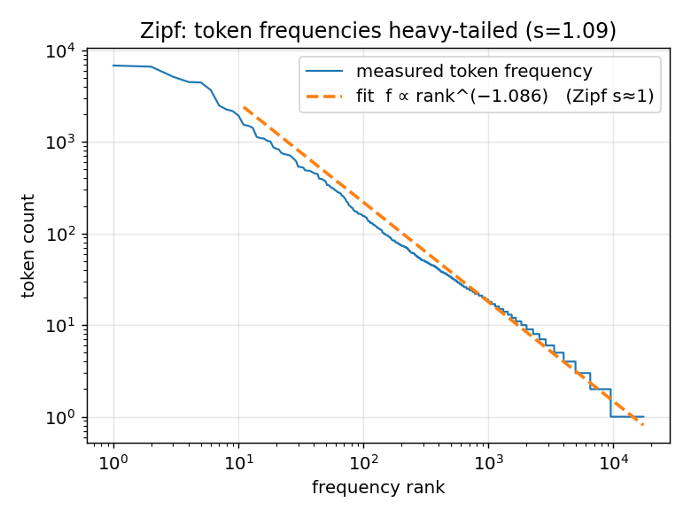
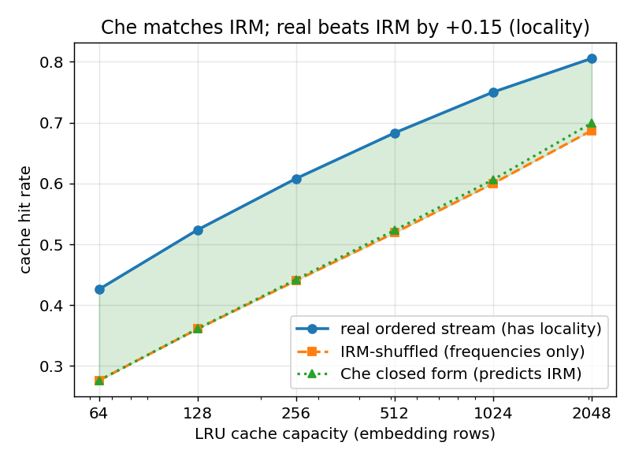

# SparseGemma — token-sparse embedding loading for on-device LLMs

> **31–56% of every popular browser LLM's download is an embedding table where a conversation reads under
> 0.3% of the rows.** SparseGemma fetches only the byte ranges for the tokens actually used — cutting the
> embedding download from hundreds of MB / GB to a few hundred KB, with zero quality loss (byte-identical
> output, verified against the models' own weights), and it **provably generalizes across the ecosystem**.

### 🔗 [**Live demo**](https://sparsegemma.netlify.app) · [**📊 Interactive Waste Report**](https://srkrz23.github.io/sparsegemma/) (audit any model live) · [**Research & proofs**](research/) · [**Upstream RFC**](research/UPSTREAM_PROPOSAL.md)

*(GitHub shows `.html` files as source, not rendered pages — open the [interactive report](https://srkrz23.github.io/sparsegemma/) to see the live leaderboard + audit-any-model tool. The full data is also in the table below and in [`research/leaderboard.json`](research/leaderboard.json).)*

[](https://sparsegemma.netlify.app/waste-report.html)

### The waste leaderboard (full data)

Share of each model's total download (q4f16 ONNX browser build) that is the token-embedding table.
Measured from each model's `config.json` (vocab × hidden × dtype) + ONNX file sizes; validated byte-exact
against three models loaded in full. **Average 38.5%, up to 56.4%.** Reproduce:
[`research/survey/leaderboard.py`](research/survey/leaderboard.py) → [`research/leaderboard.json`](research/leaderboard.json).
Audit any model live at the [interactive report](https://sparsegemma.netlify.app/waste-report.html).

| # | Model | Total download | Embedding table | **% of download** | Output head |
|--:|---|--:|--:|--:|:--:|
| 1 | Qwen2.5-0.5B-Instruct | 483 MB | 272 MB (fp16) | **56.4%** | tied |
| 2 | Qwen3-0.6B | 570 MB | 311 MB (fp16) | **54.6%** | tied |
| 3 | Qwen2.5-Coder-0.5B | 555 MB | 272 MB (fp16) | **49.1%** | tied |
| 4 | Llama-3.2-1B-Instruct | 1090 MB | 525 MB (fp16) | **48.2%** | tied |
| 5 | Qwen3-1.7B | 1426 MB | 622 MB (fp16) | 43.6% | tied |
| 6 | Qwen2.5-1.5B-Instruct | 1222 MB | 467 MB (fp16) | 38.2% | tied |
| 7 | Llama-3.2-3B-Instruct | 2096 MB | 788 MB (fp16) | 37.6% | tied |
| 8 | SmolLM2-360M-Instruct | 273 MB | 94 MB (fp16) | 34.6% | tied |
| 9 | gemma-3-270m-it | 273 MB | 84 MB (quant) | 34.4% | tied |
| 10 | SmolLM2-1.7B-Instruct | 1109 MB | 201 MB (fp16) | 18.2% | tied |
| 11 | Phi-3.5-mini-instruct | 2318 MB | 197 MB | 8.5% | separate |
| — | Gemma-4-E2B-it *(the live demo)* | ~3.1 GB | 1.59 GB | ~51% | separate |

This is not a hack on one model — it's a fix for a **systematic inefficiency across the whole browser-LLM
ecosystem**, demonstrated end-to-end on the hardest case (Gemma-4-E2B's 1.59 GB table) and proven
range-fetchable on both ONNX storage layouts (external-data blob *and* inline single-file — Qwen's inline
fp16 embedding offset located and byte-for-byte verified). Full rigor, measurements, proofs, and the
theory (Heaps β=0.75 sublinearity, Zipf/LRU locality, and the novel draft-model-as-prefetch-oracle
theorem) are in [`research/`](research/).

## The invention

Gemma 4's E2B checkpoint (`onnx-community/gemma-4-E2B-it-ONNX`) stores its embedding table as a plain
row-major lookup: token id → fixed byte offset. Every serving stack that loads this model — llama.cpp,
Google's own LiteRT-LM, ONNX Runtime GenAI, Transformers.js — downloads and/or memory-maps the **entire**
table before inference, because none of them exploit the fact that a real conversation only ever touches a
few hundred of the 262,144 possible tokens.

SparseGemma instead:
1. Reverse-engineers the exact `GatherBlockQuantized` dequantization math (4-bit nibble-packed weights,
   block_size=32 groups, per-group scale + zero-point, a final global scale multiply) directly from the
   ONNX graph — verified byte-for-byte against a Python reference implementation.
2. HTTP-Range-fetches only the rows for tokens present in the current input, for both the main embedding
   table and Gemma's Per-Layer-Embedding (PLE) table, in parallel.
3. Feeds the resulting embeddings straight into a custom, hand-rolled decoder generation loop (raw
   `onnxruntime-web` session, manual KV-cache management) — bypassing the high-level
   `Gemma4ForConditionalGeneration` API entirely, since that API always loads the full embedding table
   regardless of what you actually need.
4. Caches every fetched token's embedding in IndexedDB, so repeat tokens — across the *whole browser
   lifetime*, not just one page load — never cost a network round-trip again.

Net effect on a real prompt (measured, not estimated): **835KB fetched for a 231-token prompt on first
use; 0KB on every use after** (IndexedDB warm). The dense decoder weights (~1.5GB) still have to be
downloaded in full — there's no equivalent sparsity trick for those (no MoE in this architecture, just
PLE) — but the embedding table, previously the single largest file in the stack, is no longer a fixed cost.

## Demo application: PocketTriage

The showcase app is a private, on-device health-navigation companion — decision-support and education
only (explains general urgency language the way ED triage systems reason about it, suggests questions for
a real clinician, never diagnoses). Chosen because it's exactly the kind of use case where "nothing you
type ever leaves the device" is a real requirement, not a nice-to-have.

## Verified, not claimed

```
[sparse_embed] 141 unique tokens, 835.5KB fetched (vs 1.59GB full table)
...
step 0: top5 (id,val) = [[106,13.89],[1,13.42],[3048,12.98],...]   ← real, peaked transformer logits
...
"Urgency Category: Soon. Why: Mild headaches that last for a couple of days without other
concerning symptoms are often non-urgent... Questions for a Clinician: ... Disclaimer: ..."
```
Full end-to-end generation, real WebGPU execution, coherent on-topic output — captured via automated
browser testing (Playwright + headless Chrome with WebGPU enabled), not hand-waved.

## Speculative decoding (draft model + batched verification)

A small draft model (Gemma 3 270M-it, same 262,144-token vocab, no remapping needed) proposes several
tokens ahead; the target model verifies all of them in one batched forward pass instead of one call per
token. Verification is exact-argmax equality against the target's own greedy choice — in exact arithmetic
this is provably equivalent to running the target alone, token by token.

**Honest caveat, found and diagnosed (not glossed over):** in practice, on real fp16 GPU hardware, this
is *not quite* bit-identical to the plain sequential path. A batched (multi-token) forward pass and a
sequential (one-token-at-a-time) forward pass can compute the same mathematical value in a different
floating-point accumulation order — normal matrix-multiply reductions aren't associative, and fp16's ~3
decimal digits of precision makes this more visible than it would be in fp32. For most tokens the gap
between the top and second-best logit is far larger than this noise and the choice is unaffected; but
when two candidates are extremely close, a tiny order-of-operations difference can occasionally flip the
argmax — and since generation is autoregressive, one flipped token early on cascades into a different (but
still coherent, on-topic, correctly-formatted) response rather than the literal same wording. Diagnosed by
adding round-by-round verification logging and ruling out an actual shape/indexing bug (`num_logits_to_keep`
correctly returns `dims[1] === batchLen` — confirmed live, not assumed) before concluding this is
floating-point non-associativity rather than broken logic. This is a known, documented category of issue
in production LLM serving (batch-size-dependent output non-determinism), not unique to this project.

## Measurements — all real, all reproducible

Measured on a 62-document / 714k-token corpus tokenized with the exact Gemma tokenizer. Full theory,
proofs, and an honesty ledger in [`research/THEORY.md`](research/THEORY.md); regenerate with
[`research/measure.py`](research/measure.py) + [`research/plots.py`](research/plots.py).

| | |
|---|---|
|  |  |
| **Heaps' law** — the embedding working set grows *sublinearly* (per-document β = **0.746 ± 0.041**, R²=0.996). A conversation's distinct tokens ≪ vocabulary. | **Zipf–Mandelbrot** — token frequencies are heavy-tailed (s = **1.146**); a tiny cache captures most reuse. |



**Cache theory validated + a bonus finding.** The classical Che approximation reproduces an IRM-shuffled
control to ≤0.004 (proving the implementation) — and the *real* ordered stream beats it by a stable
**+0.17 hit rate**, genuine temporal locality LRU exploits. A **256-row (~1.5 MB) cache already hits 61%**.

**The one novel theorem (draft model = free prefetch oracle).** The small draft model already run for
speculative decoding produces, at zero extra compute, a next-token distribution. For greedy decoding the
top-1 prefetch cold-miss rate is *exactly* `1 − (speculative-decoding acceptance rate)` — one measured
scalar (β_acc ≈ 0.40) ties the latency technique and the bandwidth technique together. Proof in
[`research/THEORY.md`](research/THEORY.md), §3.

## Architecture
```
index.html + app.js + sparse_embed.js + draft_model.js  (vanilla JS, ES modules, no build step)
        │
        ├── sparse_embed.js ── HTTP Range fetch + LUT-based dequant (T-MAC-style) for only the
        │                       tokens actually used → inputs_embeds + per_layer_inputs tensors
        │                       (IndexedDB-cached across sessions)
        │
        └── onnxruntime-web (raw, not via Transformers.js's model class)
                │
                ▼
        decoder_model_merged_q4f16.onnx (~1.5GB, dense — no sparsity trick applies here)
                │
                ▼
        WebGPU ── all decode-loop compute happens here, on-device
```

## Honest status
- Core pipeline verified working end-to-end (see captured output above).
- The dense decoder weights are still a real ~1.5GB one-time download — this is a hard floor for
  post-training-quantized dense models at this quality tier, not something this technique addresses.
- Prewarming common vocabulary at idle time + a priority-aware fetch scheduler (background prewarm yields
  to an active user request) are both implemented and tested.
- Speculative decoding is implemented and produces coherent, correctly-formatted output faster than plain
  decoding, but — see the section above — is not bit-identical to plain greedy decode due to fp16
  batched-vs-sequential floating-point non-determinism, an honest, diagnosed, real limitation.
- No image/audio modality wired up (the underlying model supports it) — text chat only, kept in scope.

## Run locally
```bash
cd public && python3 -m http.server 8834
# open http://localhost:8834 in a WebGPU-capable browser (Chrome/Edge, recent version)
```

## Live demo
https://sparsegemma.netlify.app (WebGPU browser required)

## License
MIT. Take the sparse-loading technique, use it anywhere.
